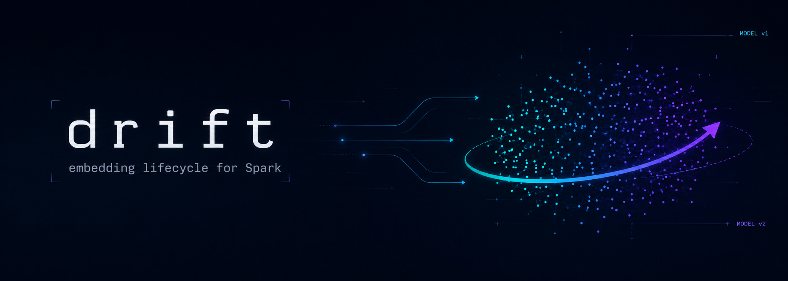
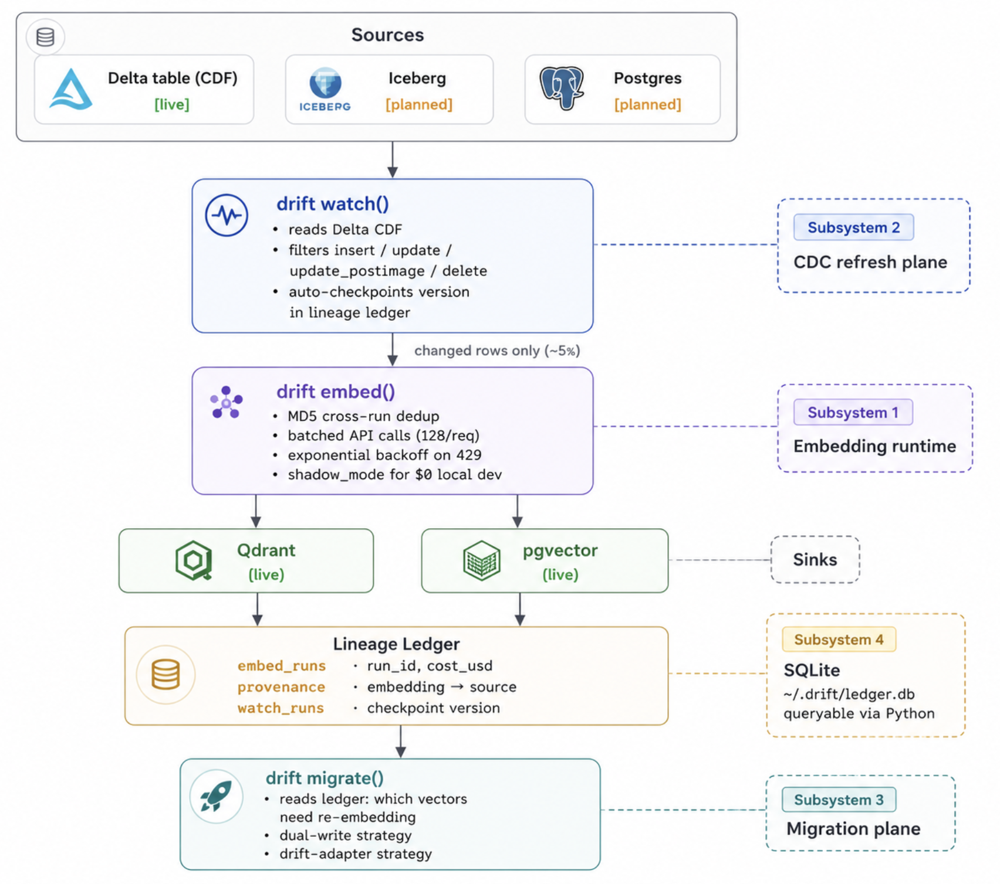

<div align="center">



<h1>Drift</h1>

**Spark-native embedding lifecycle — _dbt for embeddings, Terraform for vector indexes._**

<p>
  <a href="https://pypi.org/project/drift-spark/"></a>
  <a href="https://pypi.org/project/drift-spark/"></a>
  <a href="https://github.com/aayush4vedi/drift-spark/actions/workflows/ci.yml"></a>
  <a href="https://codecov.io/gh/aayush4vedi/drift-spark"></a>
  <a href="https://pypi.org/project/drift-spark/"></a>
  <a href="https://arxiv.org/abs/2509.23471"></a>
  <a href="https://github.com/aayush4vedi/drift-spark/blob/main/LICENSE"></a>
</p>

<p>
  <a href="#install"><b>Install</b></a> ·
  <a href="#quickstart"><b>Quickstart</b></a> ·
  <a href="#what-drift-does"><b>Features</b></a> ·
  <a href="#architecture"><b>Architecture</b></a> ·
  <a href="#api-reference"><b>API</b></a> ·
  <a href="#how-drift-compares"><b>Comparison</b></a> ·
  <a href="#contributing"><b>Contributing</b></a>
</p>

</div>

Most teams build RAG on the same throwaway script: read the table, batch-call the embedding API, upsert to a vector store, repeat tomorrow. Drift replaces that with three commands — **`embed`**, **`watch`**, **`migrate`** — and adds the things the script never had: **dedup**, **incremental refresh**, **cost tracking**, and **safe model upgrades**.

> [!NOTE]
> The `drift-adapter` upgrade path is a reference implementation of the **Drift-Adapter** paper ([arXiv:2509.23471](https://arxiv.org/abs/2509.23471), EMNLP 2025): near zero-downtime embedding-model migration using Orthogonal Procrustes.

---

## Install

```bash
pip install drift-spark
```

Optional sinks and the full stack:

```bash
pip install 'drift-spark[qdrant]'                  # Qdrant sink
pip install 'drift-spark[pgvector]'                # pgvector sink
pip install 'drift-spark[spark,qdrant,pgvector]'   # Spark + all sinks
```

---

## Quickstart

> [!TIP]
> No `OPENAI_API_KEY` is required for local development. `shadow_mode=True` uses deterministic mock vectors at zero cost — dedup and provenance behave identically.

```python
from pyspark.sql import SparkSession
from drift import embed, watch
from drift.ledger import Ledger

spark = SparkSession.builder.master("local[*]").getOrCreate()

df = spark.createDataFrame([
    {"id": "1", "body": "Customer reports login issue after password reset."},
    {"id": "2", "body": "Invoice for Q1 shows wrong billing address."},
    {"id": "3", "body": "Feature request: dark mode for the dashboard."},
])

# --- Run 1: embed all 3 rows ---
run = embed(
    df=df,
    text_col="body",
    model="openai/text-embedding-3-small",
    sink="qdrant://localhost:6333/demo",
    shadow_mode=True,          # no API key needed
)
print(run)
# EmbedRun(n_rows_processed=3, n_rows_deduped=0, cost_usd=0.0, duration_s=0.14)

# --- Run 2: same data, everything deduped (no API call even with a real key) ---
run2 = embed(df=df, text_col="body", model="openai/text-embedding-3-small",
             sink="qdrant://localhost:6333/demo", shadow_mode=True)
print(run2)
# EmbedRun(n_rows_processed=3, n_rows_deduped=3, cost_usd=0.0, duration_s=0.03)

# --- CDC refresh: only changed rows ---
watch_run = watch(
    source_table="catalog.support_docs",   # Delta table with CDF enabled
    text_col="body",
    sink="qdrant://localhost:6333/demo",
    model="openai/text-embedding-3-small",
    shadow_mode=True,
)
print(watch_run)
# WatchRun(n_inserted=31200, n_updated=18800, n_deleted=412, duration_s=4.1)

# --- Model upgrade: train an adapter, keep your existing collection ---
from drift import migrate
from drift.adapter import DriftAdapter

mig = migrate(
    from_model="openai/text-embedding-ada-002",
    to_model="openai/text-embedding-3-small",
    sink="qdrant://localhost:6333/demo",
    strategy="drift-adapter",
    shadow_mode=True,
)
print(mig)
# MigrateRun(arr=0.98, adapter_path='drift_adapter_a1b2c3d4.npy', ...)

# At query time: embed with the new model, rotate, search the old collection.
adapter = DriftAdapter.load(mig.adapter_path)
# q_new = openai.embeddings.create(model="text-embedding-3-small", input="...").data[0].embedding
# hits  = qdrant.query_points("demo", query=adapter.predict(q_new), limit=10)
```

> [!NOTE]
> See [`examples/query_after_migration.py`](examples/query_after_migration.py) for a runnable end-to-end of both `drift-adapter` and `dual-write`, including the post-cutover query code each strategy requires.

<details>
<summary><b>Prefer the CLI?</b></summary>

```bash
drift embed --table catalog.support_docs --text-col body \
            --model openai/text-embedding-3-small \
            --sink qdrant://localhost:6333/support_docs --shadow-mode

drift watch --table catalog.support_docs --text-col body \
            --sink qdrant://localhost:6333/support_docs

drift migrate --from openai/text-embedding-ada-002 \
              --to   openai/text-embedding-3-small \
              --sink qdrant://localhost:6333/support_docs \
              --strategy drift-adapter

drift status --sink qdrant://localhost:6333/support_docs
```

</details>

---

## Why Drift exists

Every data team building RAG has a script like this:

```python
df = spark.read.table("catalog.support_docs")   # reads ALL 10M rows
rows = df.select("doc_id", "body").toPandas()

for batch in chunked(rows["body"].tolist(), 512):
    resp = openai.embeddings.create(model="text-embedding-3-small", input=batch)
    qdrant.upsert(collection_name="support_docs", points=[...])
```

Whoever wrote it has since left. It re-embeds all 10M rows every night even though 95% of them never changed, burning roughly **$190 a run** on `text-embedding-3-small`. Finance asks which table cost what last week, and nobody can answer. OpenAI deprecated `text-embedding-ada-002` six months ago, but the migration keeps slipping because no one wants to own the weekend it might break. Then a GDPR delete request lands, and the team can't actually prove the vector is gone.

That is the gap Drift fills. **Three functions, and the bookkeeping is handled for you.**

---

## What Drift does

| Subsystem | Function | What it gives you |
|---|---|---|
| **Runtime** | `embed()` | Declarative embedding with cross-run dedup, batching, backoff, and per-run cost tracking |
| **CDC refresh** | `watch()` | Incremental re-embed of only the rows that changed via Delta Change Data Feed |
| **Migration plane** | `migrate()` | Model upgrades without a full reindex — `dual-write` and `drift-adapter` strategies |
| **Lineage ledger** | `Ledger` | Cost, provenance, and compliance audit trail in local SQLite |

### `embed()` — the runtime

This is the declarative replacement for that hand-rolled `pandas_udf`. It **dedupes across runs** (an MD5 hash per text, scoped to the `(model, sink)` pair, so a text already embedded in an earlier run never hits the API again), batches requests, backs off exponentially on 429s, and writes **idempotent point IDs** (a deterministic UUID from the text hash, so retries are safe). Every run records its cost. Set `shadow_mode=True` and it runs with no API key at all, using deterministic mock vectors — identical texts still map to identical vectors, so dedup and provenance stay correct in CI.

### `watch()` — incremental CDC refresh

`watch()` reads the Delta Change Data Feed from the last checkpoint and embeds **only the rows that actually changed**. On a 10M-row table with 5% daily churn, that is the difference between ~$40 a run for `embed()` and ~$2 a run for `watch()`. It handles `insert`, `update_postimage`, and `delete` (deleted source rows get their vectors removed using the same deterministic point ID), and it writes the Delta version watermark back to the ledger so the next run resumes exactly where this one stopped.

### `migrate()` — model upgrades

When you change embedding models, Drift already knows from the ledger which vectors need re-embedding. You pick a strategy: **`dual-write`** re-embeds into a fresh collection while the old one keeps serving traffic, and **`drift-adapter`** skips the reindex entirely by aligning the two model spaces with a learned rotation. A `shadow-eval` strategy (split traffic across both collections, report the recall delta before you cut over) is on the roadmap.

### The math behind `drift-adapter`

Two embedding models place the same text in differently-rotated spaces. The trick from the paper: find the single rotation `R` that lines them up, then apply it at query time so the **old index never gets touched**.

```
M = X_old.T @ X_new          # cross-covariance, shape (d, d)
U, Σ, Vt = svd(M)
R = U @ Vt                    # optimal orthogonal rotation — closed-form, ~15s on CPU

# at query time:
adapted_vec = new_query_vec @ R.T
hits = qdrant.query("my_collection", query=adapted_vec, limit=10)
```

There is a quality gate: the adapter has to hit **ARR ≥ 0.97** or `migrate()` raises `AdapterQualityError` and tells you to fall back to `dual-write`. Some model pairs genuinely can't be aligned this way — GloVe to MPNet, for instance, tops out around 71.5% because their spaces are architecturally incompatible. The gate catches that for you.

→ Full derivation, failure analysis, and roadmap: [docs/drift-adapter-math.md](docs/drift-adapter-math.md)

### Lineage ledger — cost, provenance, compliance

This is the part that answers the awkward questions. Every `embed()` and `watch()` run logs to a local SQLite ledger at `~/.drift/ledger.db`, and you query it straight from Python:

```python
from drift.ledger import Ledger
ledger = Ledger()

# cost by model
ledger.cost_by_model()
# [{'model': 'openai/text-embedding-3-small', 'cost_usd': 4.27}]

# full lineage for a single vector (GDPR audit)
ledger.provenance("3f2a1b8c-...")
# {'embedding_id': '3f2a1b...', 'source_hash': 'abc...', 'model': '...', 'cost_usd': 0.0038}

# last 5 runs for a sink
ledger.recent_runs("qdrant://localhost:6333/support_docs")
```

---

## Architecture

<p align="center">
  
</p>

---

## API reference

<details>
<summary><b>Full API & CLI reference</b></summary>

### `embed(...) → EmbedRun`

```python
embed(df, text_col, model, sink, *, dedup, batch_size, shadow_mode, source_table, ledger)
```

| Parameter | Default | Description |
|---|---|---|
| `df` | — | PySpark DataFrame (or `None` when `source_table` is given) |
| `text_col` | — | Column name containing the text to embed |
| `model` | — | `"provider/model-name"`, e.g. `"openai/text-embedding-3-small"` |
| `sink` | — | `"qdrant://host:port/collection"` or `"pg://..."` |
| `dedup` | `True` | Skip rows already embedded with this `(model, sink)` pair |
| `batch_size` | `128` | Texts per API call (OpenAI max: 2048) |
| `shadow_mode` | `False` | Deterministic mock vectors — no API key, zero cost |

Returns `EmbedRun(run_id, n_rows_processed, n_rows_deduped, cost_usd, duration_s)`.

### `watch(...) → WatchRun`

```python
watch(source_table, text_col, sink, *, model, since_version, shadow_mode, ledger)
```

| Parameter | Default | Description |
|---|---|---|
| `source_table` | — | Delta table name (must have CDF enabled) |
| `text_col` | — | Column to embed |
| `sink` | — | Sink URI |
| `model` | `"openai/text-embedding-3-small"` | Embedding model |
| `since_version` | `None` | Delta version to start from (auto-resolved from ledger) |

Returns `WatchRun(n_inserted, n_updated, n_deleted, since_version, to_version, duration_s)`.

### CLI

```
drift embed   --table TABLE --text-col COL --model MODEL --sink URI [--shadow-mode]
drift watch   --table TABLE --text-col COL --sink URI [--since-version N] [--shadow-mode]
drift migrate --from MODEL --to MODEL --sink URI --strategy dual-write
drift status  --sink URI
```

</details>

---

## How Drift compares

| Capability | Drift | Mosaic AI VS | qdrant-spark | Daft |
|---|:---:|:---:|:---:|:---:|
| Embedding generation + dedup | Yes | No | No | Yes (faster) |
| CDC refresh | Yes (triggered) | Yes (continuous) | No | No |
| Model migration | Yes | No (full reindex) | No | No |
| Per-embedding lineage + cost | Yes | No | No | No |
| Runs outside Databricks | Yes | No | Yes | Yes |

Full adversarial breakdown: [docs/competitors.md](docs/competitors.md)

---

## Known gaps & roadmap

**v0.5.0 ships:** `embed()` (dedup, batching, shadow mode), `watch()` (Delta CDC), `migrate()` (dual-write + Drift-Adapter), ARR quality gate, SQLite lineage ledger.

**Known limitations:**
- `embed()` collects all texts to the Spark driver via `toPandas()` — safe to ~2M rows; distributed path (broadcast hash set) planned for v0.6
- pgvector sink: write-only — CDC delete and `migrate()` not yet supported (planned v0.6)
- `shadow-eval` migration strategy planned, not yet implemented (planned v0.6)
- API pricing in `embed.py` is hardcoded — verify at OpenAI pricing before using for budget decisions; configurable override planned for v1.0
- Lineage ledger is single-SQLite-connection — not concurrent-safe under Spark executors

**Roadmap (rough order):**
- v0.6: shadow-eval strategy; pgvector CDC delete
- v0.7: distributed dedup (Spark broadcast variables)
- v1.0: query-time adapter interception (`DriftQueryClient`); hosted lineage UI

---

## Contributing

Issues and pull requests are welcome — see [CONTRIBUTING.md](CONTRIBUTING.md) for
the full dev setup, conventions, and check loop, and [CHANGELOG.md](CHANGELOG.md)
for release notes. Security issues: please follow [SECURITY.md](SECURITY.md)
rather than opening a public issue.

```bash
git clone https://github.com/aayush4vedi/drift-spark
cd drift-spark
pip install -e '.[spark,qdrant,pgvector,dev]'
pytest tests/          # unit tests — no Docker, no API key
```

Integration tests (require local Qdrant + Delta table):

```bash
python integration-tests/e2e_smoke_test.py            # all levels (L0–L6)
python integration-tests/e2e_smoke_test.py --level 2  # L0–L2 only — no Spark or Java needed
python integration-tests/it-adapter.py
python integration-tests/it-migrate.py
```

---

## License

Drift is released under the [MIT License](LICENSE).

<div align="center"><sub>Built for data teams who treat embeddings as production infrastructure.</sub></div>
